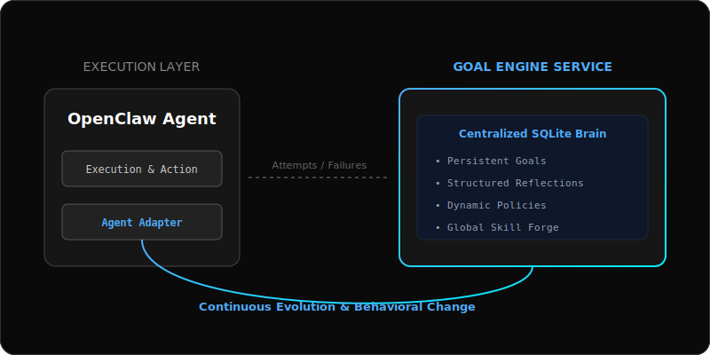

# 🚀 Goal Engine: Persistent Goal & Behavioral Evolution Engine

[English](GOAL_ENGINE_INTRO.md) | [中文](GOAL_ENGINE_INTRO_zh.md)

> **"Make agents more than just executors—make them evolutionaries that never stop until the goal is achieved."**

## 1. Vision
`goal-engine` is a goal-governance and behavioral evolution system specifically designed for autonomous agents. It solves three critical pain points in modern AI agents: **Goal Drift**, **Fragility (failure-to-quit)**, and **Static Capabilities**.

In the logic of Goal Engine, a task is not a one-off prompt interaction, but a controlled, reflective, and persistent lifecycle.

---

## 2. Architecture: Centralized Governance + Distributed Execution

*   **Goal Engine Service (Centralized Brain)**: A persistent backend powered by SQLite, storing global goals, attempts, reflections, and dynamic policies. It synchronizes cognition across distributed nodes.
*   **Agent Adapter (Execution Nerve)**: Bridges physical environments (codebase, servers, browsers) with the goal engine. It transforms raw execution data into structured "Learning Verdicts."
*   **Skill Forge (Capability Factory)**: When current means fail, it guides agents to "hunt" for new skills through web learning, documentation, or autonomous coding.

---

## 3. Differentiation: Moving Beyond Conventional Paradigms

### A. vs. Mainstream Harness Engineering
| Dimension | Traditional Harness (e.g., OpenHarness) | Goal Engine |
| :--- | :--- | :--- |
| **Focus** | **Constraint**: Ensure safety/prevent errors. | **Drive**: Prevent drift/ensure completion. |
| **State** | **Stateless**: Context destroyed after session. | **Persistent**: Survives across sessions. |
| **Feedback** | **External Audit**: Humans read logs. | **Internal Evolution**: Agent updates Policy. |
| **Means** | **Restricted**: Predefined toolkits. | **Infinite**: Can hunt/forge new skills. |

### B. vs. Other Agent Products
*   **Vs. Nvidia Voyager**: Voyager proved code-level skill libraries; Goal Engine brings this into distributed production with industrial governance.
*   **Vs. MemGPT / Letta**: MemGPT focuses on "Contextual Memory"; Goal Engine focuses on "Execution Willpower." Memory is the foundation; the Goal is the soul.
*   **Vs. AutoGPT**: AutoGPT often falls into loops; Goal Engine enforces path calibration via structured `Retry-Guard` and `Reflection`.

---

## 4. Ecosystem & Future

*   **Cooperation**: Acts as a "Cognitive Plugin" alongside sandboxes (safety) and swarms (sharing).
*   **Squeeze Loop**: Every failure is squeezed for a lesson, written to SQLite, and used to update the global Policy.
*   **Autonomous Tooling**: In the future, Goal Engine won't just use tools—it will "grow" tools in the environment based on goal requirements.

---

**Goal Engine is not just managing tasks; it is engineering "willpower."** it is the cornerstone for agents to achieve true autonomy, self-healing, and self-evolution in distributed environments.
