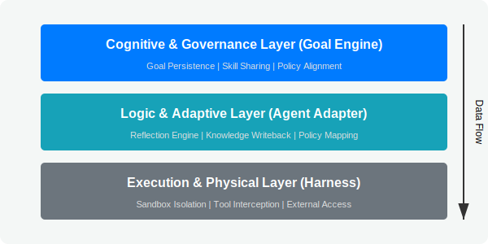
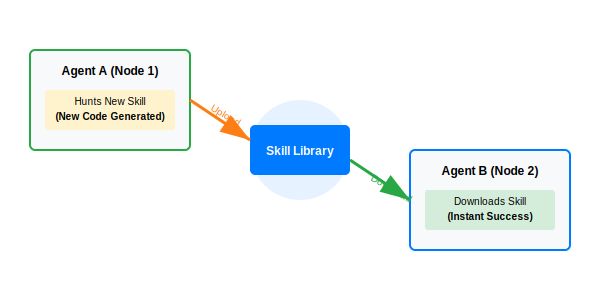
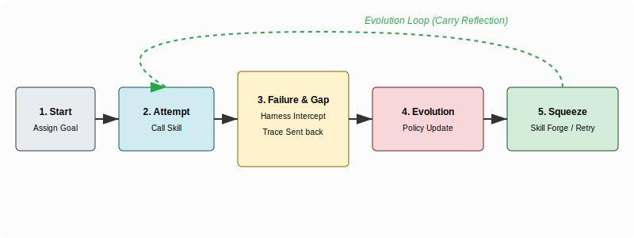

# 🚀 Goal Engine: 目标持久化与行为演进引擎 (Introduction)

[English](GOAL_ENGINE_INTRO.md) | [中文](GOAL_ENGINE_INTRO_zh.md)

> **“让 Agent 不仅仅是执行者，而是不达目的誓不罢休的进化体。”**

## 1. 项目愿景 (Vision)
`goal-engine` 是一个专为自主 Agent 设计的**目标治理与行为演进系统**。它通过中心化的后端服务与分布式的执行适配器（Adapter），解决了当前 AI Agent 最致命的三个痛点：**目标漂移（Goal Drift）**、**脆弱性（失败即放弃）**以及**能力停滞（Static Capability）**。

在 `goal-engine` 的逻辑中，任务不是一次性的 Prompt 交互，而是一个**受控的、可反思的、且必须被达成的生命周期**。

---

## 2. 核心架构：中心化治理 + 分布式执行 (Architecture)

*   **Goal Engine Service (中心化大脑)**：基于 SQLite 的持久化后端，存储全局目标、尝试记录（Attempts）、反思（Reflections）和动态策略（Policies）。它负责跨节点调度认知，是分布式 Agent 的“集体意识”。
*   **Agent Adapter (执行神经)**：将物理环境（代码库、服务器、浏览器）与目标引擎连接。它负责将原始执行数据转化为结构化的“学习结论（Learning Verdict）”。
*   **Skill Forge (能力工厂)**：当现有手段失效时，引导 Agent 通过网络学习、文档检索或自主编写代码（Skill Creator）来猎取新技能，实现“手段不设限”，压榨 Agent 达成目的的一切可能性。

---

## 3. 核心竞争力：与同类范式的区别 (Differentiation)

### A. 与主流 Harness Engineering 的本质区别
| 维度 | 主流 Harness Engineering (如 OpenHarness) | Goal Engine |
| :--- | :--- | :--- |
| **重心** | **约束（Constraint）**：确保不越权、不出错 | **驱动（Drive）**：确保不放弃、不跑偏 |
| **状态** | **无状态（Stateless）**：Session 结束即销毁 | **持久化（Persistent）**：跨会话、跨环境连续 |
| **反馈** | **外部审计**：人类看日志 | **内部进化**：Agent 自主更新 Policy |
| **手段** | **受限工具集**：仅使用给定接口 | **手段不设限**：可外部学习、猎取 Skill |

### B. 与同类 Agent 产品的对比
*   **Vs. NVIDIA Voyager**：Voyager 验证了代码级“技能库”的可行性，但缺乏**中心化治理与工业级后端**。`goal-engine` 将技能演进带入了分布式生产环境。
*   **Vs. MemGPT / Letta**：MemGPT 侧重于解决“上下文记忆”；`goal-engine` 侧重于解决“执行意志”。**记忆是基础，目标才是灵魂。**
*   **Vs. AutoGPT**：AutoGPT 容易陷入无意义重试；`goal-engine` 通过结构化的 `Retry-Guard` 和 `Reflection` 强制进行路径校准，最大化压榨 Token 的剩余价值。

---

## 4. 生态位：配合、延伸与演进 (Ecosystem)

### 🤝 配合 (Cooperation)
`goal-engine` 作为**“认知增强插件”**与现有工具链无缝结合：
*   **配合 Sandbox/Harness**：利用沙箱提供安全性（物理层拦截），利用 `goal-engine` 提供连续性（认知层演进）。
*   **配合分布式集群**：在节点 1 习得的 Skill，通过中心化 Service 实时同步至节点 2 的 Agent 实例。

### 📈 延伸 (Extension)
*   **外部手段压榨**：允许 Agent 在本地权限受限时，主动申请“外部网络访问”或“云端算力”，通过 `web_search` 和 `api_discovery` 自主寻找绕过障碍的手段。
*   **多 Agent 协同博弈**：后端 Service 将宏大 Goal 拆解为多个子目标，利用分布式压榨力，在不同节点并行推进 Skill 猎取与任务执行。

### 🚀 演进 (Future)
未来的 `goal-engine` 将不再依赖预设工具。它会根据目标需求，在环境中实时“种”出工具（Autonomous Tooling），并将其资产化为全局共享的技能资产。

---

## 5. 核心逻辑速览 (Logic Flow)

1.  **Start**: 用户下发 Goal。
2.  **Attempt**: Agent 调用 Skill 尝试执行。
3.  **Reflect**: 失败后，系统强制进行 Reflection，提取 `System Gaps`。
4.  **Evolve**: 更新中心化 `Policy`，必要时触发 `Skill Creator` 习得新手段。
5.  **Persistence**: 所有认知回写 SQLite，目标在分布式网络中永远在线，直至达成。

---

**Goal Engine 不仅仅是在管理任务，它是在工程化“意志”。** 它是分布式环境下，Agent 走向真正的自主、自愈、自进化能力的基石。
